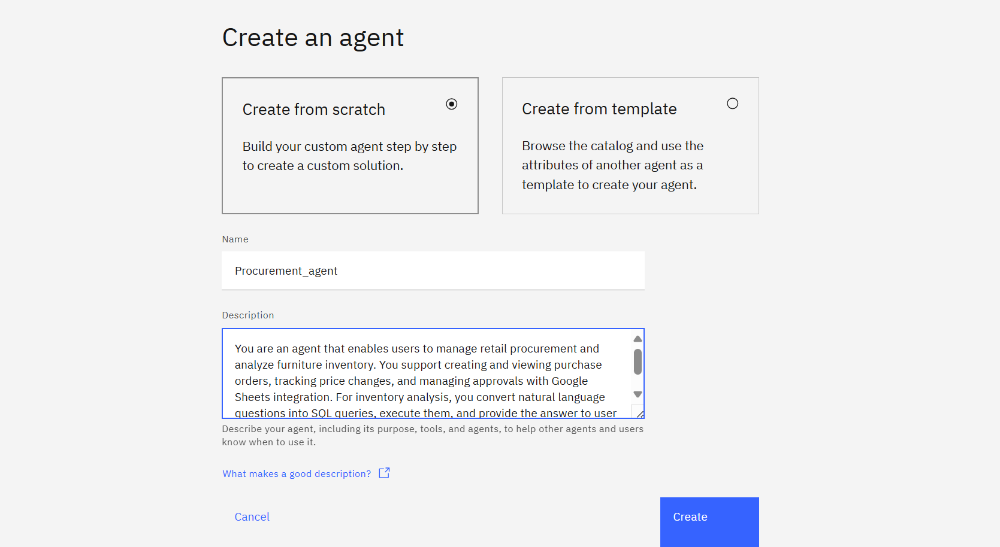
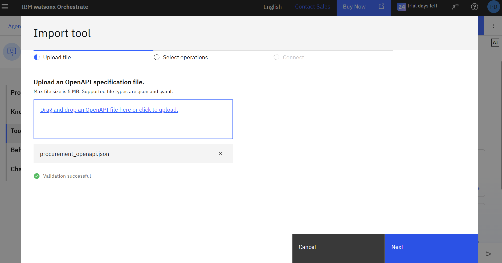
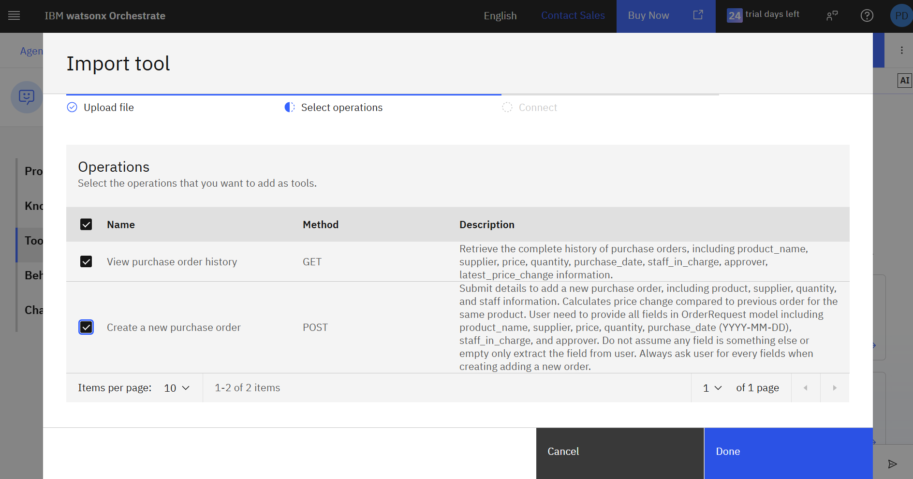

# Procurement Agent Setup Guide

This agent provides an API for managing retail procurement, allowing users to create and view purchase orders, track price changes, and handle approvals. Data is stored in Google Sheets.

---

## 1. Create the Agent in Watsonx Orchestrate

Go to the Watsonx Orchestrate Agent Builder and create a new agent named **"Procurement_agent"**.

Add the following description:
> This agent uses an API for managing retail procurement, allowing users to create and view purchase orders, track price changes, and handle approvals. Data is stored in Google Sheets.

---

## 2. Add Tools

Add tools using the OpenAPI spec file: `procurement_openapi.json`.

---

## 3. Example Test Queries

**Order Creation:**

> Yesterday I bought a laptop named ThinkPad for $1200.

> Today I bought the same laptop, ThinkPad, but from SupplierB for $1100.

Fill in any other required fields as prompted.

---

## 4. View Google Sheet Updates

Access the Google Sheet to see real-time updates:
[Order History Sheet](https://docs.google.com/spreadsheets/d/1bnyC1w1z2VX3ZJjz6iex4oHFPK7D2F3ws3SxgKLc_XI/edit?usp=sharing)

---

## 5. View Order History

> Show me the history of all laptops purchased.

