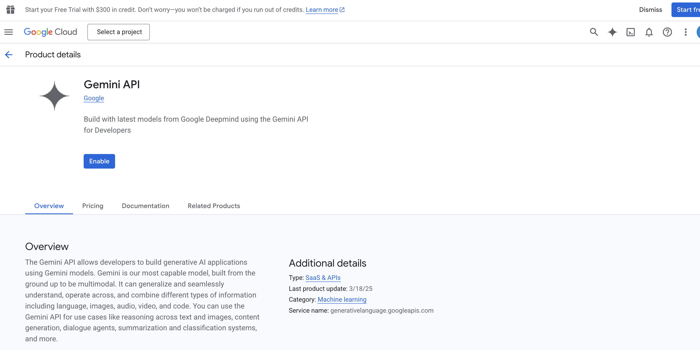

## Instructions

### Setup Gemini

To improve the model performance in Thai, watsonx Orchestrate supports using external models through feature called `AI gateway`. Read more later at: https://developer.watson-orchestrate.ibm.com/llm/managing_llm


4. Our goal is to add `google/gemini-2.5-flash` to watsonx Orchestrate. Rename `env-template` to `.env` and add in your `GOOGLE_API_KEY`.Please visit https://aistudio.google.com and click generate an API key to get your API key.


NOTE:
If you are unable to create api key, it means you haven't enabled Gemini API in Google cloud console and created a project. Hence please, enable gemini API and create a project.


Enabling Gemini API

Creating Project


5. Ensure you have completed the instructions in `00_SETUP`. Now that you have all credentials, add the model as follows. Choose to follow either UI or ADK.

    ### UI (Simplified instructions)

    Please navigate to the connections tab. And add a connection.
    

    Here you can create a connection called `gg_creds_UI`

    

    For draft environment, select the `Key Value Pair` and add the key value pair in. The key is `api_key` and the value is the API key from Gemini API you got earlier.

    

    Please repeat the same of live environment,
    The key is `api_key` and the value is the API key from Gemini API you got earlier.
    

    Once added connections, please navigate to your powershell/ terminal and type in the following command. This steps assumed you have completed `00_SETUP`

    Here is the comamnd
    ```
    orchestrate models add --name google/gemini-2.5-flash --app-id gg_creds_UI
    ```
    You should see gemini-2.5-flash model being added.

    

    
    **NOTE**: Additionally, watsonx Orchestrate provides the ability for developers to perform end to end connections creation to adding model with the ADK. Feel free to try this out at home.

    ## End of Gemini Setup
    ---

    ### End to end using ADK (Optional)

	**For Linux/macOS:**
	1. Open a terminal and navigate to the `AI_gateway/` folder.
	2. Make the scripts executable (run this once):
		```bash
		chmod +x set_connections.sh add_models.sh
		```
	3. Run the scripts:
		```bash
		./set_connections.sh
		./add_models.sh
		```

	**For Windows (PowerShell):**
	1. Open PowerShell and navigate to the `AI_gateway` folder.
	2. If you haven't already, allow running local scripts:
		```powershell
		Set-ExecutionPolicy -ExecutionPolicy RemoteSigned -Scope CurrentUser
		```
		Then restart PowerShell.
	3. Run the scripts:
		```powershell
		./set_connections.ps1
		./add_models.ps1
		```
	4. If you get an error that the script is not digitally signed (i.e., it does not have a trusted publisher's signature and was downloaded or created locally), run the following to unblock the files, then try again:
		```powershell
		Unblock-File -Path .\set_connections.ps1
		Unblock-File -Path .\add_models.ps1
		```

	You should see the model being added.


# Procurement Agent Setup Guide

This agent that enables users to manage retail procurement and analyze furniture inventory. You support creating and viewing purchase orders, tracking price changes, and managing approvals with Google Sheets integration. For inventory analysis, you convert natural language questions into SQL queries, execute them, and provide the answer to user question to help users make informed decisions.

---

## 1. Create the Agent in Watsonx Orchestrate

Go to the Watsonx Orchestrate Agent Builder and create a new agent named **"Procurement_agent"**.

Add the following description:
> You are an agent that enables users to manage retail procurement and analyze furniture inventory. You support creating and viewing purchase orders, tracking price changes, and managing approvals with Google Sheets integration. For inventory analysis, you convert natural language questions into SQL queries, execute them, and provide the answer to user question to help users make informed decisions.


---

## 2. Add Tools

Add tools using the OpenAPI spec file: `procurement_openapi.json`.


Do the same for openapi_text2sql.json
---

Add instruction in the behavior section
"Answer in the same language as user query.
Make sure you answer satisfy user question before asking to continue your task.
When asking and answering questions please make sure you do it in friendly and professional manner."

## 3. Example Test Queries

In this case you are looking for potential supplier replacement to save cost for some product you already have

first Get the latest orders from each item in order history to check the current supplier of products.

"

