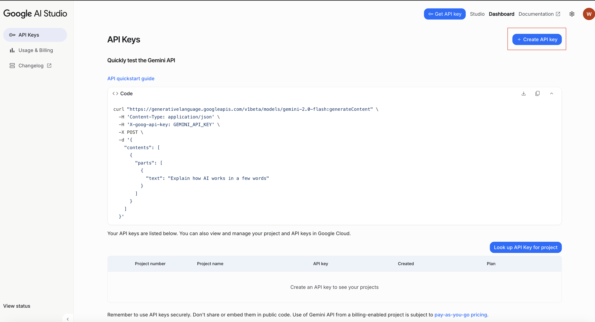
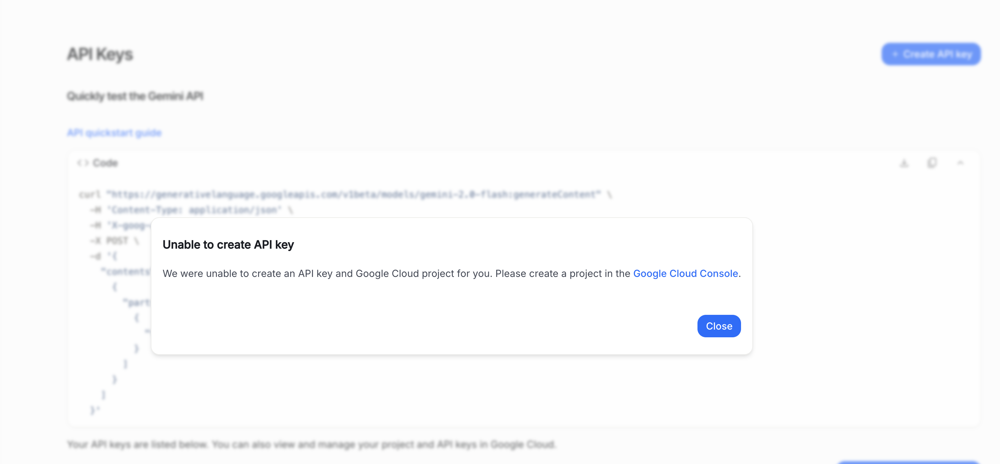

# Gemini Model Setup & Procurement Agent Guide

## 1. Gemini Model Setup

To improve Thai language performance, watsonx Orchestrate supports external models via the `AI gateway`. See more: [Managing LLMs](https://developer.watson-orchestrate.ibm.com/llm/managing_llm)

### Steps to Add `google/gemini-2.5-flash`
1. Rename `env-template` to `.env` and add your `GOOGLE_API_KEY` (get it from [Google AI Studio](https://aistudio.google.com)).
2. If you cannot create an API key, enable Gemini API and create a project in Google Cloud Console.
	- 
	- 
	- 
	- 
	- 

3. Complete the instructions in `00_SETUP`.

### Add Model via UI
1. Go to the connections tab and add a connection named `gg_creds_UI`.
	- 
	- 
2. For both draft and live environments, add a key-value pair: `api_key` = your Gemini API key.
	- 
	- 
3. In your terminal, run:
	```bash
	orchestrate models add --name google/gemini-2.5-flash --app-id gg_creds_UI
	```
	- 

## 2. Procurement Agent Setup

This agent helps users manage retail procurement and analyze inventory. It supports creating/viewing purchase orders, tracking price changes, and managing approvals with Google Sheets integration. For market analysis, it converts natural language questions to SQL queries, executes them, and provides answers to help users make decisions.

### Agent Creation
Go to Watsonx Orchestrate Agent Builder and create a new agent named **"Procurement_agent"**.

**Agent Description:**
> You are an that agent helps users manage retail procurement and analyze market inventory. It supports creating/viewing purchase orders, tracking price changes, and managing approvals with Google Sheets integration. For market analysis, it converts natural language questions to SQL queries, executes them, and provides answers to help users make decisions 


### Agent Behavior Instructions

```markdown
How To Use Tools
1. View purchase order - use this to view the history of order placed
2. create new purchase order - use this to place new order *when placing order always provide detail summary and yes no question to make sure the information is correct. before placing order. after place order, provide the summarize again in mark down tabel format
3. convert_text_to_sql - use this to convert questions about product data in the current market inventory into SQL queries and execute them against the furniture database. if the data are showable in markdown tabel format, do so.
4. send_email - Send email via Gmail with support for CC and BCC recipients

Answer in the same language as user query.
Make sure you answer satisfy user question before asking to
continue your task.
When asking and answering questions please make sure you do
it in friendly and professional manner.
```

**Add Tools**
Add tools using the OpenAPI spec file: `procurement_openapi.json`, `openapi_text2sql.json`, `automation_openapi.json`


**Select only these tools from each OpenAPI spec:**

- `procurement_openapi.json`: View purchase order history, Create a new purchase order
- `openapi_text2sql.json`: convert_text_to_sql
- `automation_openapi.json`: send_email


## 3. Example Test Queries (Thai)

1. ดึงข้อมูลออเดอร์ล่าสุดของแต่ละสินค้าในประวัติการสั่งซื้อ

	

2. ขอดูข้อมูลของสินค้า 3 ชนิดนี้ในตลาด

	
	
	
	

3. เปรียบเทียบราคาสินค้าในประวัติการสั่งซื้อกับราคาสินค้าในตลาด เพื่อดูว่าอันไหนราคาต่ำกว่า
	

4. ผมพึ่งสั่งซื้อโต๊ะกาแฟไม้สน rustic ราคา 399.99 บาท ช่วยเพิ่มในประวัติให้หน่อย

	
	
	
	

5. ส่งอีเมลสรุปรายการสินค้าที่สั่งนี้ไปหา {Your email} ด้วยหัวข้อ "New order"

	
	
---

## 4. Flow Overview

1. Get the latest orders from each item in order history (to check prices for possible supplier substitute)
2. Compare to current market prices and suggest changes if lower prices are found
3. Create order in order history Google Sheet
4. Confirm order and update order history
5. View order info from order history in Google Sheet
6. Send as a report (email)

---

