### Instructions

This lab shows how to create an agent and a simple flow that accepts a job position from the user and generates job criteria for resume screening.

Goal
- Create an agent named `resume_screening_agent`.
- Set the agent style to `ReAct`.
- Add a tool that points to a new flow called `resume_screening_tool`.
- Build a flow that asks the user for a job position and returns JSON-formatted job criteria.

Prerequisites
- Access to the Studio UI where agents and flows are created.

Steps

1) Create the agent
- Create a new agent named `resume_screening_agent`.
- Change the agent style from `Default` to `ReAct` to make the agent more interactive.


2) Add a tool that uses a new flow
- In the agent settings, open the Toolset section and click `Add tool`.
- Choose `Create a new flow`.

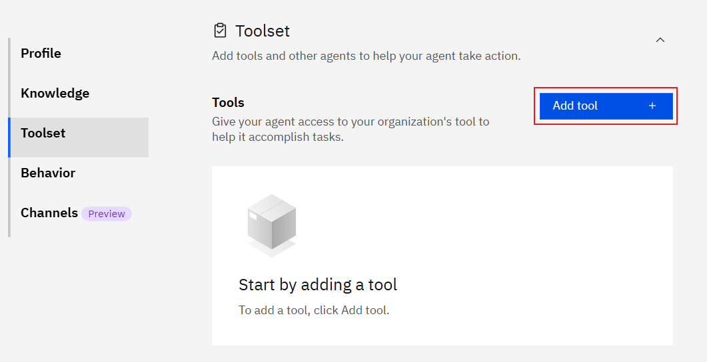
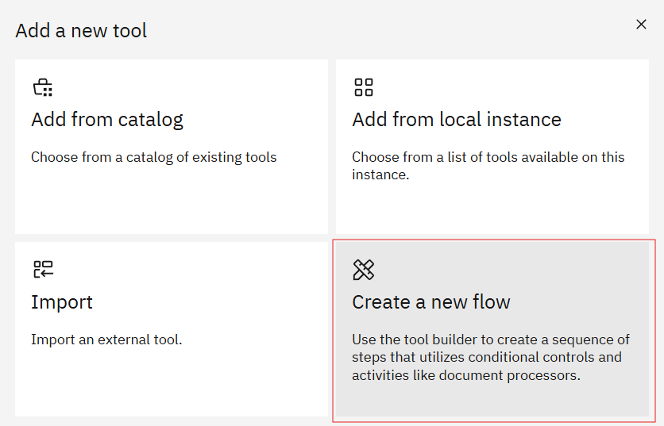

- Click the flow title (usually `Untitled`) in the top-left to open the flow settings.

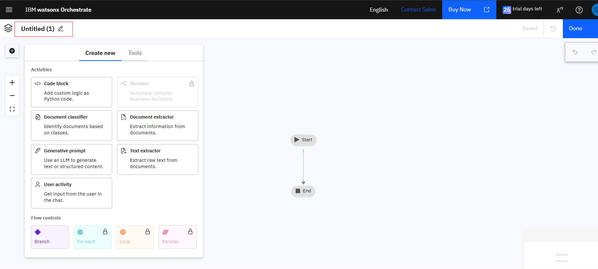

- Change the tool name to `resume_screening_tool` and set the description to `Use this tool to get resume scoring`.
- Click Save.

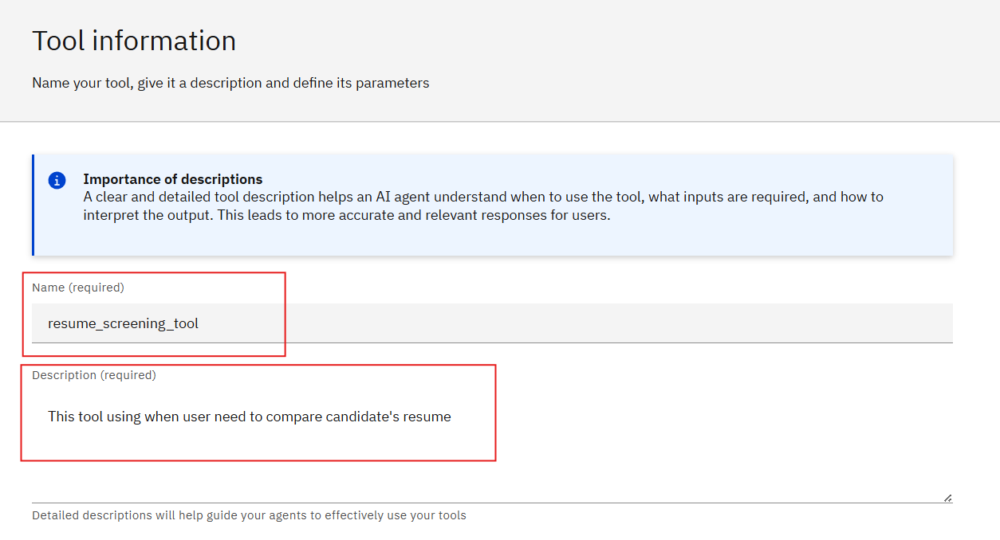

#### Create the workflow

1) Add a User Activity node
- Hover over the connection line between Start and End until a plus (+) appears.
- Click the plus icon and select `User activity` from the menu.

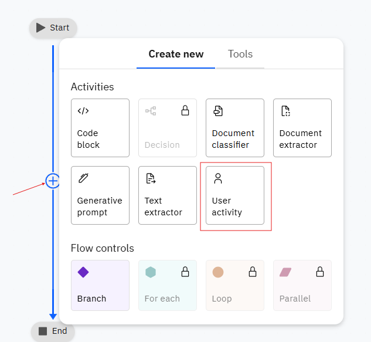
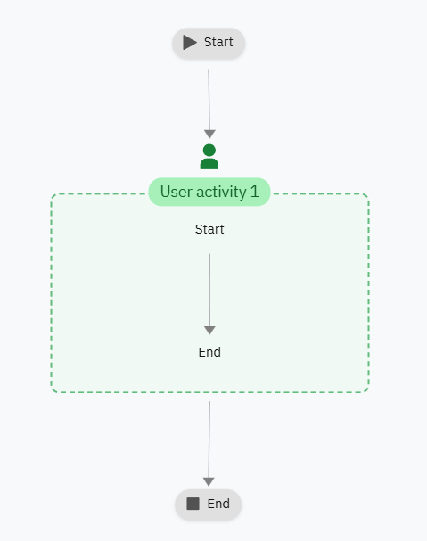

2) Ask the user for the job position
- Edit the User Activity node's display name to: "Please enter the job position"

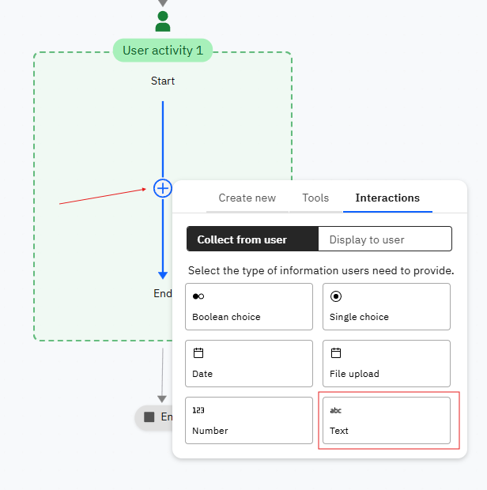

3) Add a Generative Prompt inside the User Activity
- Drag a `Generative prompt` into the User Activity node.
- Rename it to `Generative Job Position`.
- Click Edit to accept input from the previous step.

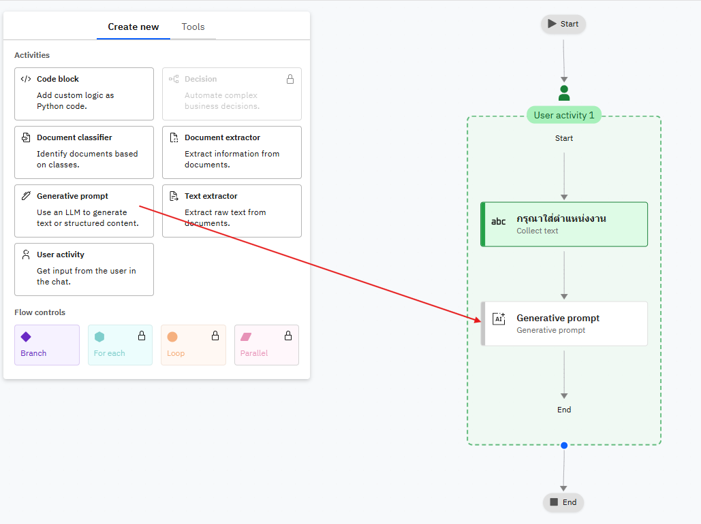

Configuration for the Generative Prompt

- Input variable:
  - Name: `job_position`
  - Description: `Job position which user is interested`
  - Click `Add` to save the input variable.

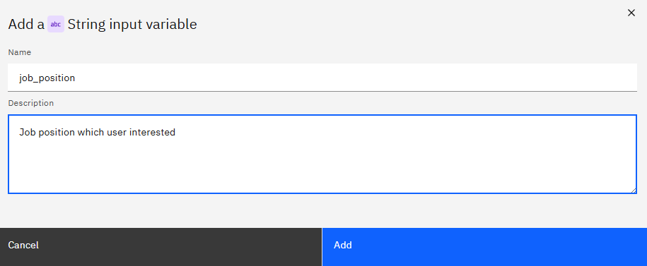

- System prompt (use the exact rules below):

```
Rules: 
1. Answer in JSON format only.
2. You will get a job position from the user query and you must return only information related to that job position.
3. Do NOT ask any questions to the user. The user will provide only a job position; return JSON only.

Example 1 (Software Engineer):
Input = Software Engineer
We are seeking a Software Engineer to join our banking technology team. The candidate will be responsible for developing and maintaining backend applications that support our digital payment systems. The role requires strong programming skillwds in Java and Python, knowledge of Spring Boot, SQL databases, and REST APIs. Familiarity with cloud platforms (AWS/Azure), Docker, and Kubernetes is a plus. Strong problem-solving abilities and teamwork are essential.

Example 2 (Reception Team Member):
Input = Reception Team Member
We are looking for a Reception Team Member to be the first point of contact for our guests. The role includes greeting visitors, handling phone calls, scheduling appointments, and assisting with basic administrative tasks. The ideal candidate should have strong communication and customer service skills, be well-organized, and be able to multitask in a fast-paced environment. Experience in hospitality or office administration is preferred.

Example 3 (Sales Executive):
Input = Sales Executive
We are seeking a motivated Sales Executive to drive business growth by identifying opportunities, building strong client relationships, and achieving sales targets. The role involves presenting products, negotiating deals, and managing the full sales cycle from prospecting to closing. Candidates should have 1–3 years of sales experience, excellent communication and negotiation skills, and familiarity with CRM tools. We offer competitive salary with commission, career development opportunities, and a supportive team environment.
```

- User prompt (what the flow will send to the model):
```
job position:
```

You should see similar to this when the prompt is configured:

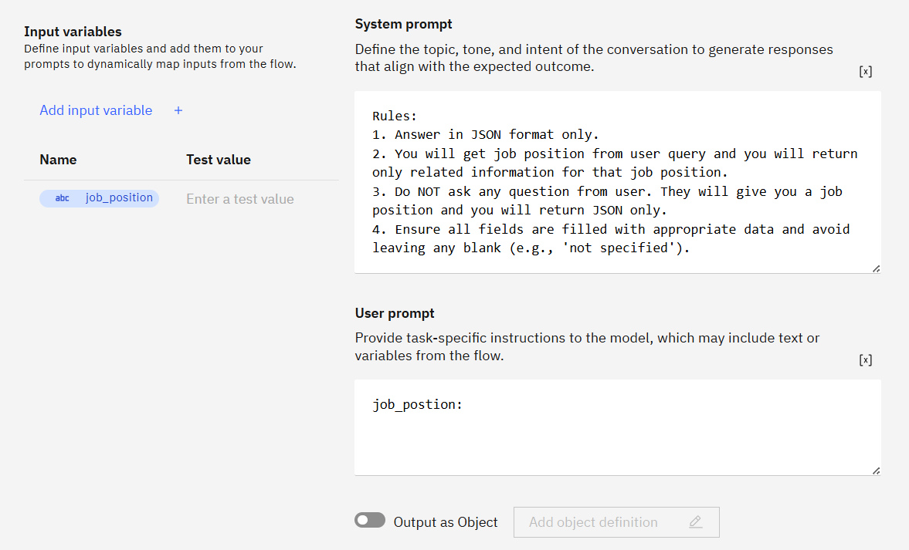


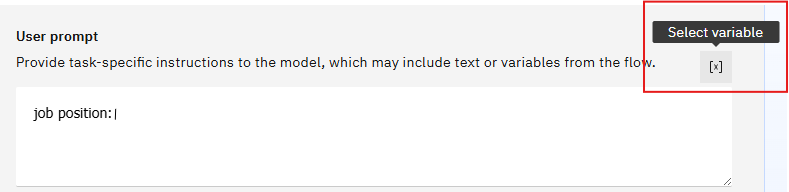

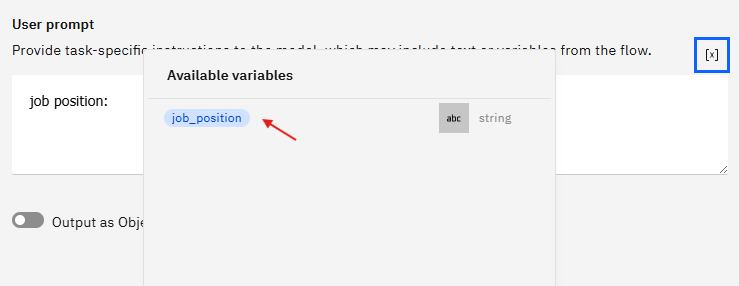

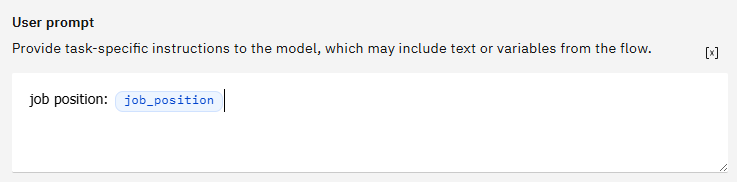

- Now will custom output of this generative prompt

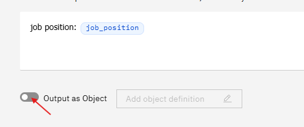

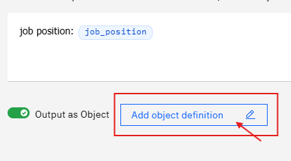

Change object output name to ```required_skill_job_description ```

with this JSON schema
```
{
    "type": "object",
    "$schema": "http://json-schema.org/draft-07/schema#",
    "required": [
        "exp",
        "yrs_of_exp",
        "position",
        "skills",
        "soft_skills",
        "industry_exp"
    ],
    "properties": {
        "exp": {
            "type": "string"
        },
        "skills": {
            "type": "array",
            "items": {
                "type": "string"
            },
            "minItems": 1
        },
        "position": {
            "type": "string"
        },
        "yrs_of_exp": {
            "type": "number",
            "minimum": 0
        },
        "soft_skills": {
            "type": "array",
            "items": {
                "type": "string"
            },
            "minItems": 1
        },
        "industry_exp": {
            "type": "string"
        }
    },
    "additionalProperties": false
}
```

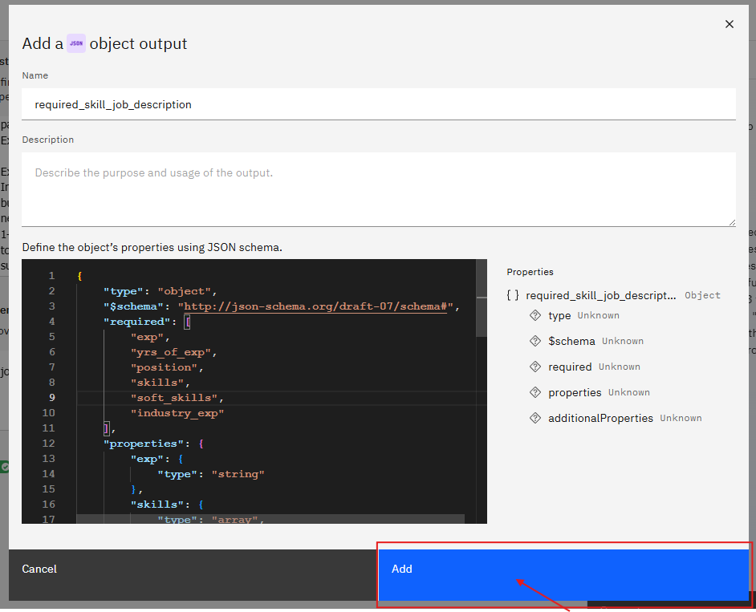

- Change the model to ``` llama-4-maverick-17b-128e-instruct-fp8 ```, Test Generative output :

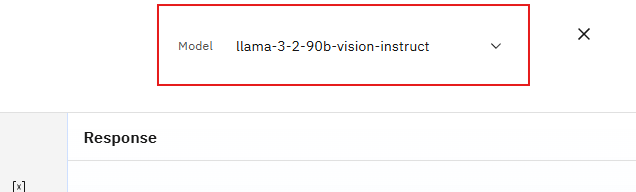

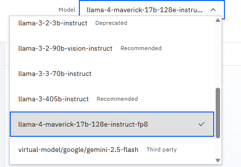
