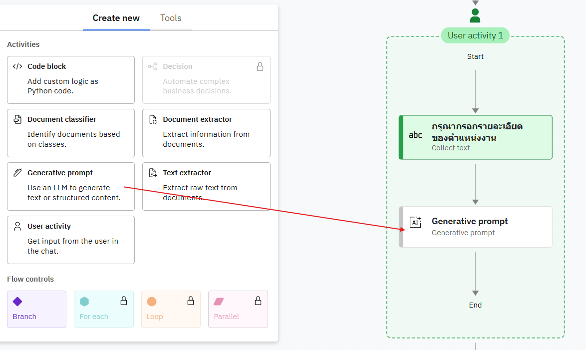

### Instructions

This lab shows how to create an agent and a simple flow that accepts a job position from the user and generates job criteria for resume screening.

Prerequisites
- Access to the Studio UI where agents and flows are created.

Steps

1) Create the agent
- Create a new agent named `resume_screening_agent`.
- Change the agent style from `Default` to `ReAct` to make the agent more interactive.


2) Add a tool that uses a new flow
- In the agent settings, open the Toolset section and click `Add tool`.
- Choose `Create a new flow`.


- Click the flow title (usually `Untitled`) in the top-left to open the flow settings.


- Change the tool name to `resume_screening_tool` and set the description to `Use this tool to get resume scoring`.
- Click Save.


#### Create the workflow
1) Add a User Activity node
- Hover over the connection line between Start and End until a plus (+) appears.
- Click the plus icon and select `User activity` from the menu.


2) Ask the user for the job position
- Edit the User Activity node's display name to: "Please enter the job position"


3) Add a Generative Prompt inside the User Activity
- Drag a `Generative prompt` into the User Activity node.
- Rename it to `Generative Job Position`.
- Click Edit to accept input from the previous step.



named it as **Generatative prompt expected_criteria**


Configuration for the Generative Prompt

- Input variable:
  - Name: `job_position`
  - Description: `Job position which user interested`
  - Click `Add` to save the input variable.


- System prompt (use the exact rules below):

```
Rules:
1. Answer in JSON format only. 
2. You will get job position from user query and you will return only related information for that job position. 
3. Do NOT ask any question from user. They will give you a job position and you will return JSON only.
4. Ensure all fields are filled with appropriate data and avoid leaving any blank (e.g., 'not specified').
```

- User prompt (what the flow will send to the model):
```
job position:
```

You should see similar to this when the prompt is configured:


- Now will custom output of this generative prompt


Change object output name to ```expected_criteria ``` with ```expected_criteria align with job``` as descripiton

with this JSON schema
```
{
  "skills": {
    "type": "string"
  },
  "experience": {
    "type": "string"
  }
}
```


- Change the model to ``` llama-4-maverick-17b-128e-instruct-fp8 ```, Test Generative output :


Output would be simliar like this


4) Now add new flow to upload candidate's resume 


change name to  **Resume uploader1**


5) Add a Document Extractor  inside the User Activity
- Drag a `Document Extractor` into the User Activity node.
- Rename it to `Resume extractor1`.


