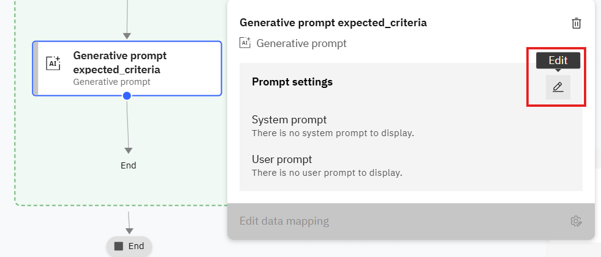
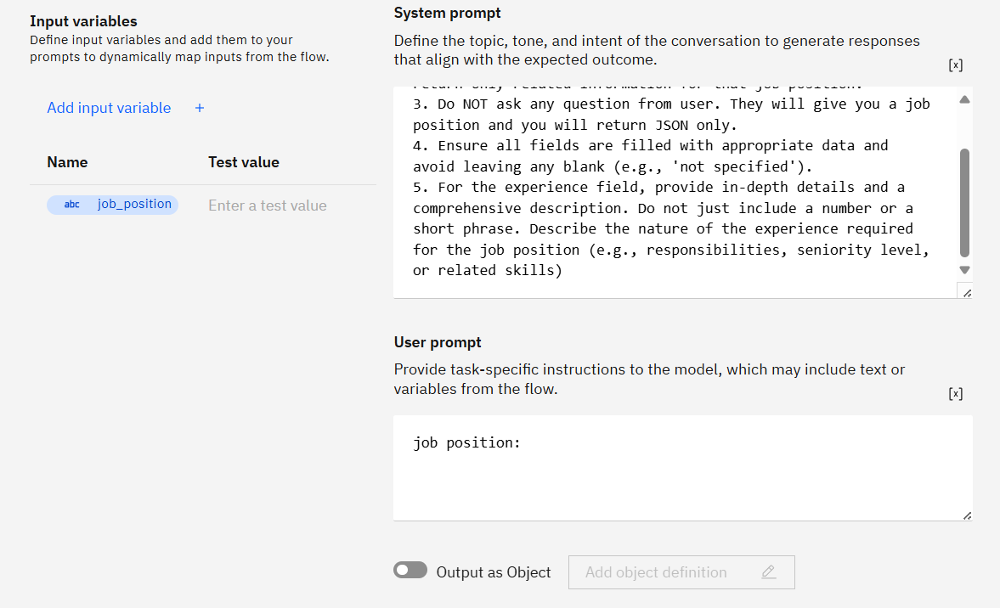
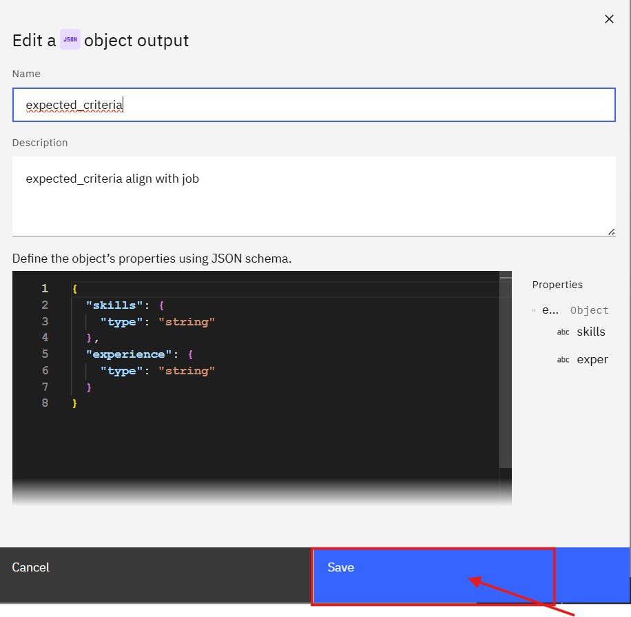
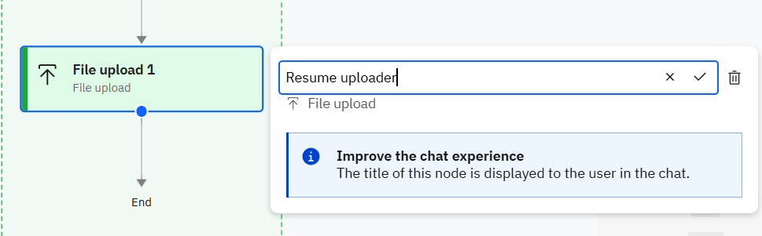
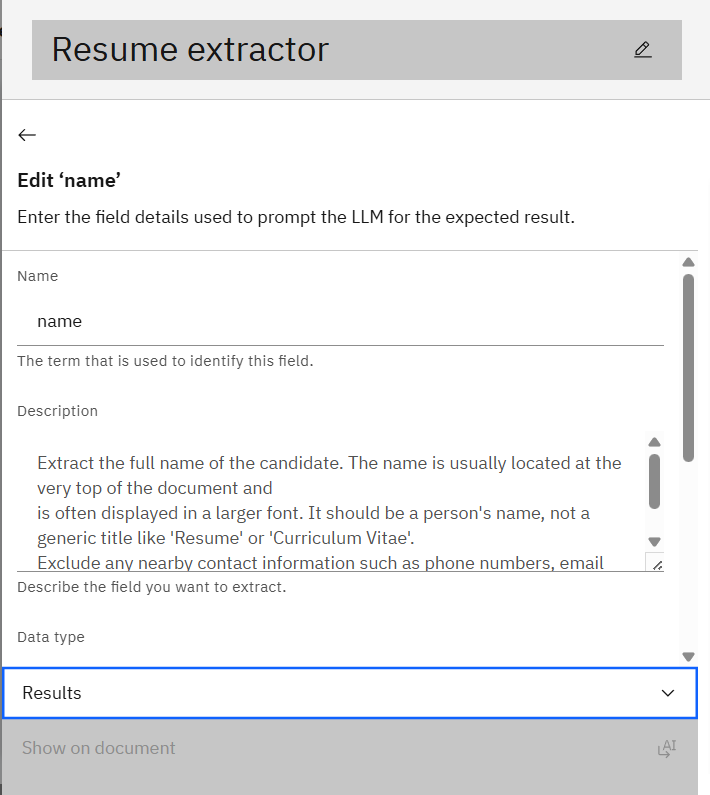

### Instructions

This lab shows how to create an agent and a simple flow that accepts a job position from the user and compares candidates' resumes to determine who aligns better with the job position. The output will be a score for each candidate, indicating how well their resume matches the job position.

Prerequisites
- Access to the Studio UI where agents and flows are created.

## Steps

1. **Create the agent**
    1.1 Choose `create from scratch`
    1.2 Create a new agent named `resume_screening_agent` 
    1.3 Set the description to :
    `This agent using when need to compare candidate's resume align with job position the output will be scoring of each candidate resume` 
---

2. Add a Tool that Using a New Flow
    2.1 In the agent settings, open the Toolset section and click **Add tool**.
    2.2 Choose **Create a new flow**.
    
    

    2.3 Click the flow title (usually `Untitled`) in the top-left to open the flow settings.
    

    2.4 Change the tool name to `resume_screening_tool` and set the description to `This tool using when user need to compare candidate's resume`.
    2.5 Click Save.

    
---

#### Create the workflow
1) Add a User Activity node
- Hover over the connection line between Start and End until a plus (+) appears.
- Click the plus icon and select `User activity` from the menu.


---

2) Ask the user for the Job Position
- Edit the User Activity node's display name to: `กรุณาใส่ตำแหน่งงาน`


---

3) Add a Generative Prompt inside the User Activity
- Drag a **Generative prompt** into the User Activity node.
- Rename it to `Generative Job Position`.
- Click Edit to accept input from the previous step.


- rename it to **Generatative prompt expected_criteria**


---

4) Configuration for the Generative Prompt
  4.1 Input variable:
    - Name: `job_position`
    - Description: `Job position which user interested`
    - Click `Add` to save the input variable.




4.2 System prompt (use the exact rules below):

```
Rules:
1. Answer in JSON format only. 
2. You will get job position from user query and you will return only related information for that job position. 
3. Do NOT ask any question from user. They will give you a job position and you will return JSON only.
4. Ensure all fields are filled with appropriate data and avoid leaving any blank (e.g., 'not specified').
5. For the experience field, provide in-depth details and a comprehensive description. Do not just include a number or a short phrase. Describe the nature of the experience required for the job position (e.g., responsibilities, seniority level, or related skills)
```

4.3 User prompt (what the flow will send to the model):
```
job position:
```

You should see similar to this when the prompt is configured:




---

5) Custom Output for the Generative Prompt


5.1 Change object output name to ```expected_criteria ``` with description ```expected_criteria align with job```

Use this JSON schema
```
{
  "skills": {
    "type": "string"
  },
  "experience": {
    "type": "string"
  }
}
```



- Change the model to ``` llama-4-maverick-17b-128e-instruct-fp8 ```, Test Generative output :


Output would be simliar like this.


---

6) Now Add new flow to upload Candidate's Resume 


6.1 change name to  **Resume uploader1**



---

7) Add a 1st Document Extractor  inside the User Activity
  7.1 Drag a `Document Extractor` into the User Activity node.
  7.2 Rename it to `Resume extractor1`.
  7.3 Click Edit Fields


---
8) Download and Upload Sample Resumes
  8.1 Download resumes from:
    -  `sample/jr-sale-resume.pdf` 
    -  `sample/sr-sale-resume.pdf`
  8.2 Upload `jr-sales-resume.pdf`

  8.3 Click **Add Field**, name it as `name1` and configure the Field


Put Description as `Candidate name`



And Click **Back Arrow** top left corner.

8.4 Click **Add Field**, names it as `skills1` and configure the Field

- For skills1 Using Description as
```
List all the skills mentioned, including both technical (hard) and interpersonal (soft) skills.
Provide the extracted skills in a clear and concise format, focusing on relevance to the job position.
```

8.5 Click **Add Field** names it as `experience1` and configure the Field

- For experience1 Using Description as
```
List all the skills mentioned, including both technical (hard) and interpersonal (soft) skills.
Provide the extracted skills in a clear and concise format, focusing on relevance to the job position.
```

8.6 Open document dropdown and Click **Mangage documents** and upload file from ```sameple/sr-sale-resume.pdf```


---